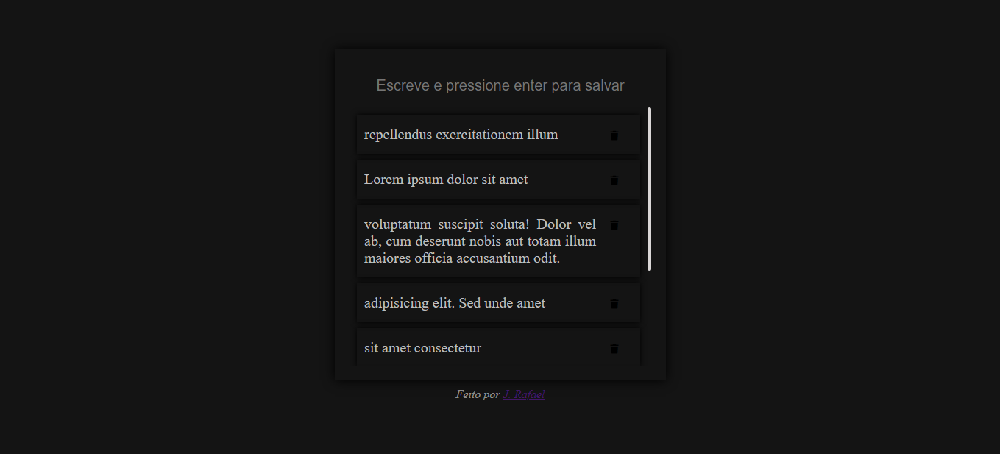

<h2> Mais um projetinho que fiz a fim de praticar o vuejs </h2>

 Pude colocar em pratica conhecimentos de emição de eventos para o componente pai e passagem de props para componente filho 

<h4> Imagem do simples projeto 

